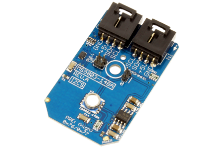

[](https://www.controleverything.com/content/Analog-Digital-Converters?sku=MS5803-14BA_I2CS)
# MS5803-14BA
MS5803-14BA Pressure and Temperature Sensor.

The MS5803-14BA device provides a digital 24-bit pressure and temperature value.

This Device is available from ControlEverything.com [SKU: MS5803-14BA_I2CS]

https://www.controleverything.com/content/Analog-Digital-Converters?sku=MS5803-14BA_I2CS

This Sample code can be used with Raspberry pi.

## Java
Download and install pi4j library on Raspberry pi. Steps to install pi4j are provided at:

http://pi4j.com/install.html

Download (or git pull) the code in pi.

Compile the java program.
```cpp
$> pi4j MS5803_14BA.java
```

Run the java program.
```cpp
$> pi4j MS5803_14BA
```

## Python
Download and install smbus library on Raspberry pi. Steps to install smbus are provided at:

https://pypi.python.org/pypi/smbus-cffi/0.5.1

Download (or git pull) the code in pi. Run the program.

```cpp
$> python MS5803_14BA.py
```

#####The code output is the pressure in mbar and temperature reading in degree celsius and fahrenheit.
